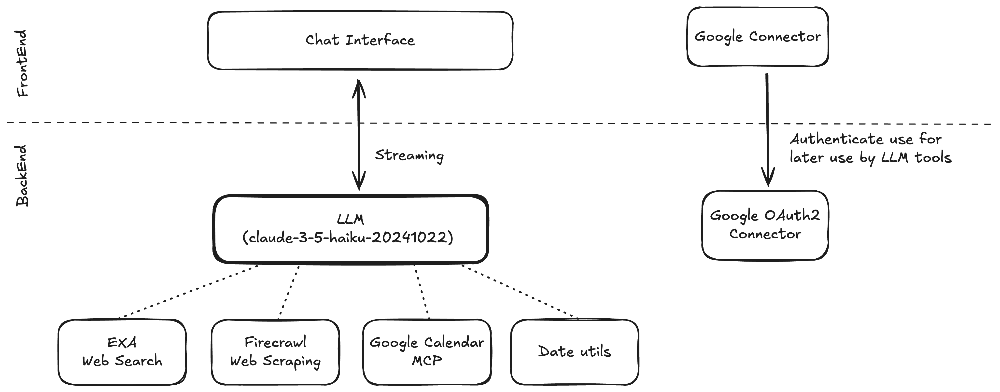
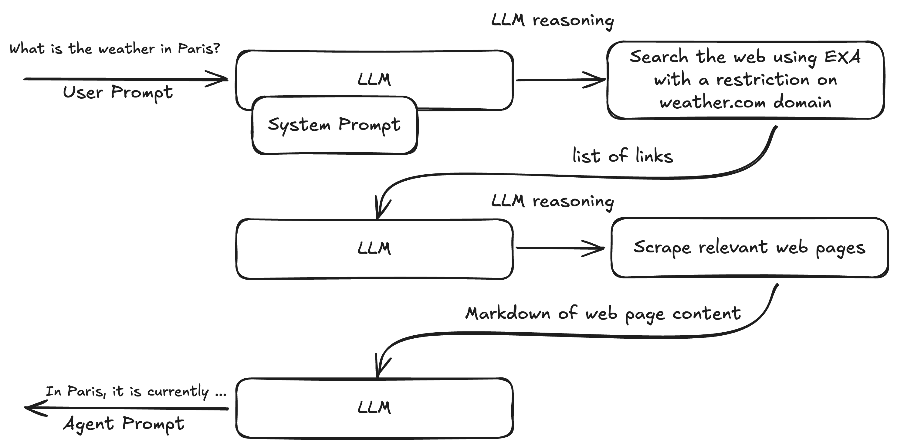

# Guided Energy — AI Weather Assistant

A Next.js-based AI chat application that provides intelligent weather information by combining real-time web scraping with natural language processing. The system uses Claude 3.5 Haiku to understand user queries and leverages multiple tools to gather and present accurate weather data.

## 🌟 Features

### Core Functionality

- **Natural Language Weather Queries**: Ask weather questions in plain English
- **Real-time Data Scraping**: Live weather data from weather.com
- **Intelligent Search**: Web search capabilities for up-to-date information
- **Google Calendar Integration**: Create and manage calendar events
- **Timezone Handling**: Automatic conversion between UTC and Paris timezone
- **Temperature Conversion**: Automatic conversion to Celsius for all temperature data

### Technical Features

- **Streaming Responses**: Real-time AI responses with tool call streaming
- **Multi-tool Architecture**: Modular tool system for different data sources
- **OAuth Integration**: Secure Google Calendar authentication
- **Modern UI**: Built with Radix UI and Tailwind CSS using ShadcnUI
- **Type Safety**: Full TypeScript implementation

## 🏗️ Architecture

The system architecture and reasoning process are documented in the following schemas:

#### Agent Schema



This diagram illustrates the overall system architecture, showing how the agent processes natural language queries and integrates with various data sources.

#### LLM Reasoning Example



This example demonstrates the step-by-step reasoning process used by the LLM to understand and respond to weather-related questions.

## 🛠️ Tech Stack

- **Frontend**: Next.js 15, React 19, TypeScript
- **AI**: Anthropic Claude 3.5 Haiku
- **Search**: Exa API for web search
- **Web Scraping**: Firecrawl for content extraction
- **Calendar**: Google Calendar API via Smithery MCP
- **UI**: ShadcnUI, Radix UI, Tailwind CSS, Lucide React
- **Build Tool**: Turbo (monorepo)
- **Package Manager**: pnpm

## 🚀 Getting Started

### Prerequisites

- Node.js >= 22.10.0
- pnpm >= 10.13.1

### Installation

1. **Clone the repository**

   ```bash
   git clone <repository-url>
   cd guided-energy
   ```

2. **Install dependencies**

   ```bash
   pnpm install
   ```

3. **Set up environment variables**

   Create a `.env` file in the root directory with the following variables:

   ```env
   # AI
   ANTHROPIC_API_KEY=your_anthropic_api_key

   # Search & Scraping
   EXA_API_KEY=your_exa_api_key
   FIRECRAWL_API_KEY=your_firecrawl_api_key

   # Authentication
   BASIC_AUTH_USER=your_basic_auth_username
   BASIC_AUTH_PASSWORD=your_basic_auth_password

   # Google Calendar Integration
   SMITHERY_API_KEY=your_smithery_api_key
   GOOGLE_CLIENT_ID=your_google_client_id
   GOOGLE_CLIENT_SECRET=your_google_client_secret
   GOOGLE_REDIRECT_URI=http://localhost:3000/api/auth/google-calendar/callback
   ```

4. **Start the development server**

   ```bash
   pnpm dev
   ```

5. **Open your browser**

   Navigate to [http://localhost:3000](http://localhost:3000)

## 📋 Available Scripts

- `pnpm dev` - Start development server
- `pnpm build` - Build for production
- `pnpm start` - Start production server
- `pnpm lint` - Run ESLint
- `pnpm format` - Check code formatting
- `pnpm typecheck` - Run TypeScript type checking

## 🔧 API Tools

The application provides several AI tools for enhanced functionality:

### 1. ExaSearchTool

- **Purpose**: Web search for up-to-date weather information
- **Scope**: Limited to weather.com domain
- **Results**: Returns 10 most relevant search results

### 2. FirecrawlScrapeTool

- **Purpose**: Extract content from weather websites
- **Features**:
  - Markdown format output
  - Main content extraction
  - Ad blocking
  - Batch URL processing

### 3. GoogleCalendarTool

- **Purpose**: Manage Google Calendar events
- **Features**:
  - Create events
  - Update existing events
  - Read calendar data
  - OAuth2 authentication

### 4. DateTools

- **current-datetime**: Get current time in UTC and Paris timezone
- **to-local-datetime**: Convert UTC times to Paris timezone
- **to-utc-datetime**: Convert local times to UTC

## 💬 Usage Examples

### Weather Queries

```
"What's the weather like in Paris today?"
"Will it rain tomorrow in London?"
"What's the temperature in New York right now?"
```

### Calendar Integration

```
"Schedule a meeting for tomorrow at 2 PM if the weather is good"
"Create a calendar event for next Friday's outdoor team lunch"
```

## 🔐 Authentication

The application uses Basic Authentication for general access and OAuth2 for Google Calendar integration:

1. **Basic Auth**: Configured via environment variables
2. **Google OAuth**: Handled through the `/api/auth/google-calendar` endpoint
3. **Token Storage**: Refresh tokens stored in localStorage for persistence

## 🏗️ Project Structure

```
guided-energy/
├── apps/
│   └── nextjs/                 # Main Next.js application
│       ├── src/
│       │   ├── app/           # App Router pages
            │   └── api/       # API routes
│       │   ├── components/    # React components
│       │   └── lib/          # Utility functions
│       └── public/           # Static assets
├── assets/                   # Documentation images
├── tooling/                  # Shared development tools
└── package.json             # Root package configuration
```

### 📁 Next.js App Directory Structure

The application follows Next.js 13+ App Router structure with clear separation between frontend and API components:

**OAuth Flow:**

- `google-oauth/page.tsx` - Google OAuth callback handler page
  - Handles OAuth code exchange
  - Stores refresh token in localStorage
  - Redirects back to main chat interface

#### 🔌 API Routes (`src/app/api/`)

**Chat API (`/api/chat/`):**

- `route.ts` - Main chat endpoint using Claude 3.5 Haiku
  - Processes streaming AI responses
  - Integrates multiple tools (search, scraping, calendar, date)
  - Handles Google Calendar authentication headers
  - Supports up to 5 tool call steps

**Tool Implementations:**

- `exa.ts` - Web search tool for weather.com data
- `firecrawl.ts` - Web scraping tool for content extraction
- `googleCalendar.ts` - Google Calendar integration via Smithery MCP
- `date.ts` - Timezone conversion utilities

**Authentication API (`/api/auth/`):**

- `route.ts` - Basic authentication endpoint
- `google-calendar/route.ts` - Google OAuth initiation
- `google-calendar/callback/route.ts` - OAuth token exchange

## 🚧 Features Lacking for Production

- **Authentication**: User authentication system
- **Chat History**: Persistent conversation storage
- **Connector Frontend**: Visual indicators for connected services
- **Error Handling**: Comprehensive error management
- **Rate Limiting**: API usage limits
- **Monitoring**: Application performance monitoring
- **Testing**: Unit and integration tests
- **Documentation**: API documentation
- **Deployment**: Production deployment configuration
